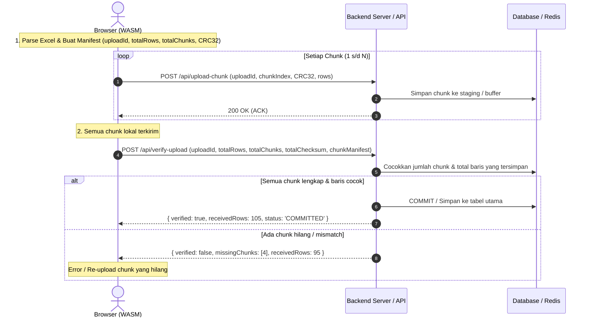

# Excel Reader Wasm ⚡

High-performance Excel spreadsheet reader and chunk uploader powered by **Rust** and **WebAssembly (WASM)** with **Completeness & Integrity Verification**.

Membaca dan memproses spreadsheet Excel (.xlsx, .xls, .ods, .csv) dengan jutaan baris langsung di browser / client secara super cepat dan efisien tanpa membebani server backend, serta mendukung streaming chunk upload dengan event `onUploading` dan verifikasi kelengkapan data di server.

---

## 🚀 Fitur Utama

- **Blazing Fast**: Ditenagai oleh engine Rust ([calamine](https://crates.io/crates/calamine)) yang dikompilasi ke WebAssembly.
- **Header Validation (`validHeader`)**: Memvalidasi baris pertama spreadsheet dengan format string pipa (`"No|Nama|Alamat|Kota"`), koma, atau array JSON.
- **Field Mapping (`mappingHeader`)**: Mapping kolom spesifik ke field JSON (misal `{"no": "No", "alamat": "Alamat"}`). Hanya kolom yang dipetakan yang diekstrak.
- **Row Chunking (`rowChunk`)**: Memecah baris data menjadi batch/chunk berukuran tetap (misal per 10 baris). Jika ada 105 baris, proses looping sebanyak 11 kali.
- **Data Integrity & CRC32 Checksum**: Setiap chunk dan keseluruhan file dihitung nilai checksum CRC32-nya secara native di Rust untuk validasi integritas data.
- **Server Completeness Verification (`verifyServer` / `onCompleted`)**: Mekanisme verifikasi untuk memastikan seluruh chunk dan total baris telah diterima sempurna oleh server sebelum proses dianggap selesai.
- **Type Safe**: Dilengkapi dengan TypeScript definitions (`index.d.ts`).

---

## 📦 Instalasi & Build

```bash
# Build WASM package ke folder pkg/
npm run build

# Jalankan Interactive Web Demo
npm run dev
```

---

## 🛠️ Cara Kerja Verifikasi Kelengkapan Data

Saat mengupload file besar dalam potongan chunk, terdapat kemungkinan salah satu chunk gagal di tengah jalan akibat gangguan jaringan. Sistem ini menerapkan arsitektur **Session Manifest & Reconciliation**:



---

## 💻 Contoh Penggunaan Frontend

### 1. Upload dengan Verifikasi Server (`verifyServer`)

```javascript
import { uploadSpreadsheet } from 'excelreaderwasm';

const file = document.getElementById('fileInput').files[0];

const result = await uploadSpreadsheet(
  file,
  'No|Nama|Alamat|Kota',                // validHeader
  { no: 'No', alamat: 'Alamat' },        // mappingHeader
  10,                                   // rowChunk (10 baris per iterasi)
  {
    // 1. Upload setiap chunk ke backend
    onUploading: async (chunk, meta) => {
      console.log(`Mengupload chunk ${meta.chunkIndex}/${meta.totalChunks} (CRC32: ${meta.checksum})`);
      
      const response = await fetch('/api/v1/import/chunk', {
        method: 'POST',
        headers: { 'Content-Type': 'application/json' },
        body: JSON.stringify({
          uploadId: meta.uploadId,
          chunkIndex: meta.chunkIndex,
          chunkSize: meta.chunkSize,
          startRow: meta.startRow,
          endRow: meta.endRow,
          checksum: meta.checksum,
          data: chunk
        })
      });

      if (!response.ok) {
        throw new Error(`Gagal mengupload chunk ${meta.chunkIndex}`);
      }
    },

    // 2. Metode verifikasi otomatis setelah semua chunk selesai
    verifyServer: async (manifest) => {
      console.log('Semua chunk terkirim. Memvalidasi kelengkapan data di server...');

      const response = await fetch('/api/v1/import/verify', {
        method: 'POST',
        headers: { 'Content-Type': 'application/json' },
        body: JSON.stringify({
          uploadId: manifest.uploadId,
          totalRows: manifest.totalRows,
          totalChunks: manifest.totalChunks,
          totalChecksum: manifest.totalChecksum,
          chunkManifest: manifest.chunkManifest
        })
      });

      return await response.json(); 
      // Server harus mengembalikan: { verified: true, receivedChunks: 11, receivedRows: 105 }
    }
  }
);

console.log('✅ Upload & Verifikasi Sukses!', result);
```

---

## 🖥️ Contoh Implementasi Endpoint Backend (Node.js / Express)

Berikut adalah contoh endpoint backend untuk menerima chunk dan memverifikasi kelengkapan:

```javascript
import express from 'express';

const app = express();
app.use(express.json());

// Tempat penyimpanan session upload sementara (bisa diganti Redis / DB staging)
const uploadSessions = new Map();

// 1. Endpoint Terima Chunk
app.post('/api/v1/import/chunk', (req, res) => {
  const { uploadId, chunkIndex, checksum, data } = req.body;

  if (!uploadSessions.has(uploadId)) {
    uploadSessions.set(uploadId, {
      chunks: new Map(),
      rowsCount: 0
    });
  }

  const session = uploadSessions.get(uploadId);
  session.chunks.set(chunkIndex, { checksum, rowCount: data.length, rows: data });
  session.rowsCount += data.length;

  res.json({ status: 'CHUNK_RECEIVED', chunkIndex });
});

// 2. Endpoint Verifikasi Kelengkapan (Finalize)
app.post('/api/v1/import/verify', async (req, res) => {
  const { uploadId, totalRows, totalChunks, totalChecksum, chunkManifest } = req.body;

  const session = uploadSessions.get(uploadId);
  if (!session) {
    return res.status(404).json({ verified: false, message: 'Upload session tidak ditemukan' });
  }

  // Cek apakah ada chunk yang bolong
  const missingChunks = [];
  for (let i = 1; i <= totalChunks; i++) {
    if (!session.chunks.has(i)) {
      missingChunks.push(i);
    }
  }

  const isComplete = missingChunks.length === 0 && session.rowsCount === totalRows;

  if (isComplete) {
    // SEMPURNA: Simpan seluruh data ke database utama di sini (Bulk Insert / Transaction)
    // await db.bulkInsert(...);
    
    // Hapus session staging
    uploadSessions.delete(uploadId);

    return res.json({
      verified: true,
      receivedChunks: session.chunks.size,
      receivedRows: session.rowsCount,
      missingChunks: [],
      status: 'COMMITTED'
    });
  } else {
    return res.status(400).json({
      verified: false,
      receivedChunks: session.chunks.size,
      receivedRows: session.rowsCount,
      missingChunks,
      status: 'INCOMPLETE'
    });
  }
});
```

---

## 📊 Struktur Objek `meta` & `manifest`

### `meta` pada `onUploading(chunk, meta)`
```typescript
{
  uploadId: "fefc58ec-4a6d-420a-9bb8-0f0c38b4fbf5",
  chunkIndex: 1,         // Chunk 1, 2, ..., 11
  totalChunks: 11,       // Total chunk
  chunkSize: 10,         // Jumlah baris dalam chunk ini
  startRow: 1,           // Baris awal data
  endRow: 10,            // Baris akhir data
  totalRows: 105,        // Total baris di Excel
  isLastChunk: false,    // True jika chunk terakhir
  progressPercent: 9.52, // Progres persen
  checksum: "d1a091b5"   // CRC32 checksum chunk
}
```

### `manifest` pada `verifyServer(manifest)` / `onCompleted(summary)`
```typescript
{
  uploadId: "fefc58ec-4a6d-420a-9bb8-0f0c38b4fbf5",
  totalRows: 105,
  totalChunks: 11,
  chunkSize: 10,
  totalChecksum: "ecc37022",
  chunkManifest: [
    { chunk_index: 1, chunk_size: 10, start_row: 1, end_row: 10, checksum: "d1a091b5" },
    // ...
    { chunk_index: 11, chunk_size: 5, start_row: 101, end_row: 105, checksum: "7f992990" }
  ]
}
```

---

## 🧪 Testing & Verifikasi

```bash
# Jalankan unit test & verifikasi integritas
node test/test_upload.js
```
